# AI期末大作业笔记

## 目录

### 一、模型相关知识
#### 1.关于大模型
#### 2.关于SOTA
#### 3.关于epoch
#### 4.关于模型参数
#### 5.yolo介绍
#### 6.四个模型对比

### 二、数据集获取及训练
#### 1.数据集获取
#### 2.数据集训练

### 三、应用可视化开发
#### 1.CSGO人物自瞄
#### 2.猜拳游戏人机对战
### 四、总结


## 一、模型相关知识
### 1.关于大模型

### 迁移学习
迁移学习通俗来讲，就是运用已有的知识来学习新的知识，核心是找到已有知识和新知识之间的相似性，用成语来说就是举一反三。由于直接对目标域从头开始学习成本太高，我们故而转向运用已有的相关知识来辅助尽快地学习新知识。比如，已经会下中国象棋，就可以类比着来学习国际象棋；已经会编写Java程序，就可以类比着来学习C#；已经学会英语，就可以类比着来学习法语；等等。世间万事万物皆有共性，如何合理地找寻它们之间的相似性，进而利用这个桥梁来帮助学习新知识，是迁移学习的核心问题。
### 微调
微调其实讲的是利用原有模型参数（“知识”）初始化现有模型，在此基础上继续train自己的model（“再加工”）。说人话就是把现成的模型略加修改然后再作少量training，主要用于样本数量不足的情形。
### 进程、线程
一个进程包括多个线程。
不同进程之间数据很难共享。
同一个进程下的不同线程数据很容易共享。
进程比线程消耗更多计算机资源。
进程之间互不影响，但是一个进程挂掉，他所在的整个进程都会挂掉。
进程可以拓展到多机，适合多核与分布式。
进程使用的内存地址可以限定使用量。
### 监督学习
是使用足够多的带有label的数据集来训练模型，数据集中的每个样本都带有人工标注的label。通俗理解就是，模型在学习的过程中，“老师”指导模型应该向哪个方向学习或调整。
### 非监督学习
是指训练模型用的数据没有人工标注的标签信息，通俗理解就是在“没有老师指导”的情况下，靠“学生”自己通过不断地探索，对知识进行归纳和总结，尝试发现数据中的内在规律或特征，来对训练数据打标签。
### 半监督学习
是在只能获取少量的带label的数据，但是可以获取大量的的数据的情况下训练模型，让学习器不依赖于外界交互，自动地利用未标记样本来提升学习性能，半监督学习是监督学习和非监督学习的相结合的一种学习方法。
### 大模型
一般指1亿以上参数的模型，但是这个标准一直在升级，目前万亿参数以上的模型也有了。大语言模型（Large Language Model，LLM）是针对语言的大模型。


### 2.关于SOTA的概念

深度学习常见名词概念：Sota、Benchmark、Baseline、端到端模型、迁移学习等的定义

#### Sota
Sota实际上就是State of the arts 的缩写，指的是在某一个领域做的Performance最好的model，一般就是指在一些benchmark的数据集上跑分非常高的那些模型。

SOTA model：并不是特指某个具体的模型，而是指在该项研究任务中，目前最好/最先进的模型。

SOTA result：指的是在该项研究任务中，目前最好的模型的结果/性能/表现。
### 非端到端模型
传统机器学习的流程往往由多个独立的模块组成，比如在一个典型的自然语言处理（Natural Language Processing）问题中，包括分词、词性标注、句法分析、语义分析等多个独立步骤，每个步骤是一个独立的任务，其结果的好坏会影响到下一步骤，从而影响整个训练的结果，这是非端到端的。
### 端到端模型
从输入端到输出端会得到一个预测结果，将预测结果和真实结果进行比较得到误差，将误差反向传播到网络的各个层之中，调整网络的权重和参数直到模型收敛或者达到预期的效果为止，中间所有的操作都包含在神经网络内部，不再分成多个模块处理。由原始数据输入，到结果输出，从输入端到输出端，中间的神经网络自成一体（也可以当做黑盒子看待），这是端到端的。
### Benchmark、Baseline
Benchmark和baseline都是指最基础的比较对象。你论文的motivation来自于想超越现有的baseline/benchmark，你的实验数据都需要以baseline/benckmark为基准来判断是否有提高。唯一的区别就是baseline讲究一套方法，而benchmark更偏向于一个目前最高的指标，比如precision，recall等等可量化的指标。举个例子，NLP任务中BERT是目前的SOTA，你有idea可以超过BERT。那在论文中的实验部分你的方法需要比较的baseline就是BERT，而需要比较的benchmark就是BERT具体的各项指标。
### 并发、并行、串行
我中午12：00开始吃饭，吃到一半，朋友打来一个电话，我需要等到我吃完饭才可以接电话，这说明我不支持并行与并发，我的运作方式属于串行，串行有一个执行单元（只有一个执行任务单元的cpu核）。

我中午12:00开始吃饭，吃到一半，朋友打来一个电话，我可以接起电话，跟朋友打完电话继续吃饭，这说明我支持并发与串行，

我中午12:00开始吃饭，吃到一半，朋友打来一个电话，我可以一边接电话一边吃饭，这说明我支持并行与并发。（并行有多个任务执行单元，多个任务可以同时执行）

所谓并发，是指我有没有同时处理多个任务的能力，不一定要同时。


3. ### 关于epoch

Epoch（时期）：
 当一个完整的数据集通过了神经网络一次并且返回了一次，这个过程称为一次>epoch。（也就是说，所有训练样本在神经网络中都 进行了一次正向传播 和一次反向传播 ）
 再通俗一点，一个Epoch就是将所有训练样本训练一次的过程。
 然而，当一个Epoch的样本（也就是所有的训练样本）数量可能太过庞大（对于计算机而言），就需要把它分成多个小块，也就是就是分成多个Batch 来进行训练。**

Batch（批 / 一批样本）：
 将整个训练样本分成若干个Batch。
 Batch_Size（批大小）：
 每批样本的大小。
 Iteration（一次迭代）：
 训练一个Batch就是一次Iteration（这个概念跟程序语言中的迭代器相似）。

为什么要使用多于一个epoch?
在神经网络中传递完整的数据集一次是不够的，而且我们需要将完整的数据集在同样的神经网络中传递多次。但请记住，我们使用的是有限的数据集，并且我们使用一个迭代过程即梯度下降来优化学习过程。如下图所示。因此仅仅更新一次或者说使用一个epoch是不够的。

在这里插入图片描述
在这里插入图片描述

 随着epoch数量增加，神经网络中的权重的更新次数也在增加，曲线从欠拟合变得过拟合。

那么，问题来了，几个epoch才是合适的呢？

不幸的是，这个问题并没有正确的答案。对于不同的数据集，答案是不一样的。但是数据的多样性会影响合适的epoch的数量。比如，只有黑色的猫的数据集，以及有各种颜色的猫的数据集。


### 4. 关于模型的参数相关名词 

#### 泛化（Generalization）
模型的泛化能力通俗易懂的说就是模型在测试集（其中的数据模型以前没有见过）中的表现，也就是模型举一反三的能力，但是这些数据必须满足与iid（独立同分布）并在同一个分布中。

举个例子：一张图片模型之前没有见过，但是这张图片与TrainDataSet在同一分布，并满足iid，模型可以很好的预测这张图，这就是模型的泛化，在测试集中，模型预测新数据的准确率越高，就可以说是模型的泛化能力越好。
#### 正则化（Regularization）
正则化即为对学习算法的修改，旨在减少泛化误差而不是训练误差。
#### 吞吐量
首先在书面解释时，速率是额定或标称的，但是实际传输时，其实不稳定的，吞吐量就是取平均值。假设你从学校骑电动车回家，这条公路限速80km/h，这就可以理解成“带宽”，也就是“最高传输速率”。所骑电动车厂家宣称最高时速30km/h，这可以理解成“速率”，也就是“额定速率或标称速率”。但是你不可能全程以30km/h速度行驶，可能会碰到红灯或者堵车，这时你的速度就会放慢了，这条路的长度除以你行驶时间所得平均行驶速度，就可以理解成“吞吐量”。
#### 指令微调
Instruction FineTuning，针对已经存在的预训练模型，给出额外的指令或者标注数据集来提升模型的性能，如P-tuning， prompt-tuning，prefix-tuning。
#### 增量微调
是指在神经网络中增加额外的层，如lora，adapter。
175B、60B、540B
这些一般指参数的个数，B是Billion/十亿的意思，175B是1750亿参数，这是GPT3的参数规模。
#### 强化学习(Reinforcement Learning）
一种机器学习的方法，通过从外部获得激励来校正学习方向从而获得一种自适应的学习能力。
#### 基于人工反馈的强化学习（RLHF)
Reinforcement Learning from Human Feedback构建人类反馈数据集，训练一个激励模型，模仿人类偏好对结果打分，这是GPT-3后时代大语言模型越来越像人类对话核心技术。
#### 涌现
研究发现，模型规模达到一定阈值以上后，会在多步算术、大学考试、单词释义等场景的准确性显著提升，称为涌现。


### 4.关于模型参数

#### YOLO是什么？
YOLO是目标检测模型。

目标检测是计算机视觉中比较简单的任务，用来在一张图篇中找到某些特定的物体，目标检测不仅要求我们识别这些物体的种类，同时要求我们标出这些物体的位置。

也就是说，一个典型的Region-base方法的流程是这样的：先通过计算机图形学（或者深度学习）的方法，对图片进行分析，找出若干个可能存在物体的区域，将这些区域裁剪下来，放入一个图片分类器中，由分类器分类。

#### 计算机视觉应用

目前计算机视觉主要应用在人脸识别、图像识别方面（包括静态、动态两类信息）。

- 图像分类(image classification)
- 目标定位(object localization)
- 目标检测(object detection)（多个目标）
- 目标跟踪(Object Tracking)
- 图像分割(Image Segmentation)
- 图像生成(Image Generation)
- 人脸识别(Face Recognition)

类别是离散数据，位置是连续数据。

### 5.yolo介绍

#### YOLO历史发展

YOLO（You Only Look Once）是一种流行的对象检测和图像分割模型，只需要浏览一次就可以识别出图中的物体的类别和位置。被称为Region-free方法，相比于图像分割Region-based方法，YOLO不需要提前找到可能存在目标的Region。

YOLO于2015年推出，以其高速度和高精度迅速走红。

YOLOv2于2016年发布，通过合并批处理规范化、锚盒和维度集群来改进原始模型

YOLOv3使用更高效的骨干网络、多个锚点和空间金字塔池进一步增强了该模型的性能

YOLOv4
- 高效的模型设计：YOLOv4的设计重点在于提高生产系统中目标检测器的操作速度和并行计算的优化，而不仅仅是降低理论计算指标（如BFLOPs）。这使得YOLOv4能够在常规GPU上实现实时、高质量和令人信服的目标检测结果。
- Bag-of-Freebies和Bag-of-Specials：YOLOv4验证了在目标检测器训练过程中使用的最新Bag-of-Freebies和Bag-of-Specials方法的影响。这些方法包括但不限于网络结构的改进、训练策略的调整以及数据增强技术等。
- 模型结构的创新：YOLOv4在架构、特征提取器（backbone）CSPDarknet53、特征融合（neck）PANet 和预测头（head）YOLOv3等方面进行了创新。它采用了一些最先进的方法，如 CBN、PAN、SAM 等，并对其进行了改进，使其更适合单 GPU 训练。
- 性能提升：与YOLOv3相比，YOLOv4在平均精度（AP）和每秒帧数（FPS）方面分别提高了10%和12%。此外，YOLOv4的运行速度是EfficientDet的两倍以上，且性能相当。
- 广泛的应用：YOLOv4的设计使其易于训练和使用，适用于各种平台，包括GPU和CPU。它适用于需要实时、高质量目标检测的各种应用场景

YOLOv5进一步提高了模型的性能，并添加了超参数优化、集成实验跟踪和自动导出到流行导出格式等新功能

YOLOv6是由美团视觉智能部研发的目标检测框架，专为工业应用而设计。它在保持高精度的同时，特别关注推理效率，旨在满足实际工业环境中对速度和准确性的不同要求。YOLOv6的设计理念是在不同规模的模型中实现最佳的速度和精度权衡，以适应多样化的应用场景。

该模型在架构和训练方案上引入了几项显著的改进，包括双向串联（BiC）模块、锚点辅助训练（AAT）策略以及改进的骨干和颈部设计，从而在 COCO 数据集上实现了最先进的精度。
- 高精度和高速度：YOLOv6-nano在COCO数据集上的精度可达35.0% AP，推理速度可达1242 FPS（每秒帧数）；YOLOv6-s的精度可达43.1% AP，推理速度可达520 FPS。
- 多平台支持：YOLOv6支持在多种硬件平台上部署，包括GPU（TensorRT）、CPU（OPENVINO）、ARM（MNN、TNN、NCNN）等，简化了工程部署时的适配工作。
- 网络设计：YOLOv6采用了RepVGG提出的结构重参数化方法，以及高效的可重参数化骨干网络（EfficientRep），以适应不同规模的模型。
- 标签分配和损失函数：YOLOv6采用了任务对齐学习（TAL）作为标签分配策略，并选择了VariFocal损失（VFL）作为分类损失，以及SIoU/GIoU损失作为回归损失。
- 量化和部署：YOLOv6使用了重新参数化优化器（RepOptimizer）进行训练，以获得对PTQ（Post-Training Quantization）友好的权重，并通过通道蒸馏（CW蒸馏）进行量化感知训练（QAT），以提高量化性能。

YOLOv7 引入了几项关键功能：

- 模型重新参数化：YOLOv7 提出了一种有计划的重新参数化模型，这是一种适用于不同网络层的策略，具有梯度传播路径的概念。
- 动态标签分配：多输出层模型的训练提出了一个新问题："如何为不同分支的输出分配动态目标？为了解决这个问题，YOLOv7 引入了一种新的标签分配方法，即从粗到细的引导标签分配法。
- 扩展和复合缩放YOLOv7 为实时对象检测器提出了 "扩展 "和 "复合缩放 "方法，可有效利用参数和计算。
- 效率：YOLOv7 提出的方法能有效减少最先进的实时物体检测器约 40% 的参数和 50% 的计算量，推理速度更快，检测精度更高。

YOLOv8支持全方位的视觉AI任务，包括检测、分割、姿态估计、跟踪和分类。这种多功能性允许用户在不同的应用程序和域中利用YOLOv8的功能

YOLOv9发布时间为2024年2月21日提出了可编程梯度信息(PGI)的概念，以应对深度网络实现多个目标所需的各种变化。
（2）设计了一种新的基于梯度路径规划的轻量级网络结构——广义高效层聚合网络(GELAN)

YOLOv10就紧接着发布于2024.5.23号，引入一致的双重分配策略，消除NMS依赖。
提出整体效率-精度驱动的模型设计策略，包括轻量级分类头、空间-通道分离下采样和基于秩的块设计。
模型架构设计仍是YOLO的一个基本挑战


#### NMS介绍

非极大值抑制（Non-Maximum Suppression, NMS）是一种常用的后处理技术，用于目标检测算法中以减少冗余检测框并确保检测结果的精确性。NMS的主要目标是在同一物体上保留一个最佳的检测框，同时抑制那些得分较低的重叠框。下面是NMS的工作原理和应用：

NMS的工作原理

- 检测框排序：首先，将所有检测框按照置信度（即检测得分）从高到低排序。
- 选择最高得分的检测框：选择得分最高的检测框作为当前的最佳检测结果。
- 计算重叠区域：对于剩余的所有检测框，计算它们与当前最佳检测框的重叠度（通常使用交并比，IoU，即Intersection over Union）。
- 抑制重叠框：将那些与当前最佳检测框的重叠度超过某一阈值的检测框抑制（即移除），因为它们很可能是对同一物体的重复检测。
- 重复步骤2-4：在剩余的检测框中，重复上述步骤，直到没有检测框剩余。
- 
NMS的局限性

尽管NMS在实践中非常有效，但它也存在一些局限性，例如：

- 参数敏感性：NMS需要设置重叠度阈值，这个参数的选择对最终结果有很大影响，过高或过低的阈值都会影响检测效果（有的时候我们用Detect的时候进行推理会出现一个物体有多个检测框其实根据参数的设置也有一定的关系）。
- 速度影响：在大规模检测任务中，NMS的计算复杂度可能会影响整体的推理速度（这也是YOLOv10去掉NMS的主要原因，提高推理速度从而实现端到端）。
无法处理复杂场景：对于一些复杂场景，如拥挤的人群或密集的目标，NMS可能无法有效区分相邻的多个目标。

此外，模型架构设计仍是YOLO的一个基本挑战，对准确性和速度有重要影响。为了实现更高效和有效的模型架构，研究人员探索了不同的设计策略。提出了各种主要计算单元来增强特征提取能力，例如DarkNet、CSPNet、EfficientRep和ELAN等。为了增强多尺度特征融合，还探索了PAN、BiC、GD和RepGFPN等。此外，还研究了模型缩放策略和重新参数化技术。尽管这些努力取得了显著进展，但缺乏对YOLO各个组件的全面检查，导致YOLO内部存在相当大的计算冗余，导致参数利用效率低下和效率不佳。此外，结果模型能力也受到限制，留有很大的精度提升空间（其实YOLOv10目前的反馈大家精度其实都不是很好）。


### 6.四个模型对比

#### YOLO

YOLO或 You Only Look Once version-7，是用于对象检测的最先进的深度学习模型。YOLO 基于原始的 YOLO 架构，但使用了更高效的主干网络和一组新的检测头。YOLO可以高精度地实时检测物体，并且可以在大型数据集上进行训练。该模型也非常高效，可以在低端设备上运行。

##### 优点：

- 非常快速和高效的物体检测
- 大型数据集的高精度
- 在低端设备上运行

##### 缺点：

- 可以与小物体检测斗争
- 需要大型数据集才能获得最佳性能
#### RetinaNet

RetinaNet是一种用于对象检测的深度学习模型，它使用特征金字塔网络和新的焦点损失函数。RetinaNet 旨在解决对象检测中前景和背景示例之间的不平衡问题，从而提高准确性。该模型效率高，可以在低端设备上运行，使其成为实时对象检测的热门选择。

##### 优点：

- 提高物体检测的准确性
- 高效，可以在低端设备上运行
- 易于训练和使用
##### 缺点：

- 可以与小物体检测斗争
- 需要大量数据以获得最佳性能
#### Faster R-CNN

Faster R-CNN是一种用于对象检测的深度学习模型，它使用区域建议网络生成候选对象位置。然后该模型使用第二个网络对建议的区域进行分类并优化它们的位置。Faster R-CNN 以其高精度而著称，通常用于图像和视频中的对象检测。

##### 优点：

- 高精度物体检测
- 对图像和视频中的物体检测有效
- 易于训练和使用
##### 缺点：

- 计算量可能很大
- 实时检测物体时可能会很慢
#### Single Shot MultiBox Detector

SSD或 Single Shot MultiBox Detector 是一种用于对象检测的深度学习模型，它使用单个网络来预测对象位置和类别。该模型使用特征金字塔网络来检测不同尺度的物体，并在物体检测中实现了高精度。SSD 还以效率着称，可以在低端设备上实时运行。

##### 优点：

- 物体检测的高精度和高效率
- 低端设备上的实时对象检测
- 易于训练和使用
##### 缺点：

- 可以与小物体检测斗争
- 可能需要大型数据集才能获得最佳性能


## 二、数据集获取及训练
### 1.数据集获取

使用Google Collab：https://colab.research.google.com/drive/12SZzNZCPgVwOAkJdo8KY-6QFYDEnpcmt#scrollTo=HI1A9_8E9bnl

使用的Roboflow数据集：https://universe.roboflow.com/national-technical-university-of-ukraine-igor-sikorsky-kyiv-polytechnic-institute-plrfe/det-ct-t/dataset/2#

#### 检查GPU

`!nvidia-smi`

<div style="text-align: center;">
    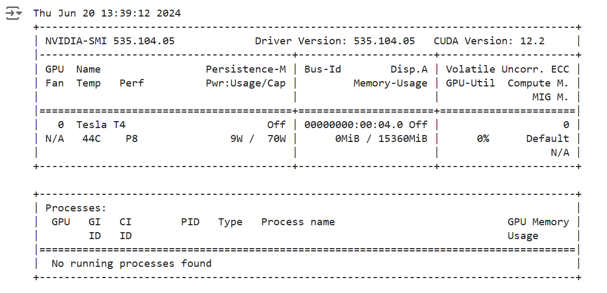
</div>

#### 安装ultralytics依赖包

`!pip install ultralytics`

<div style="text-align: center;">
    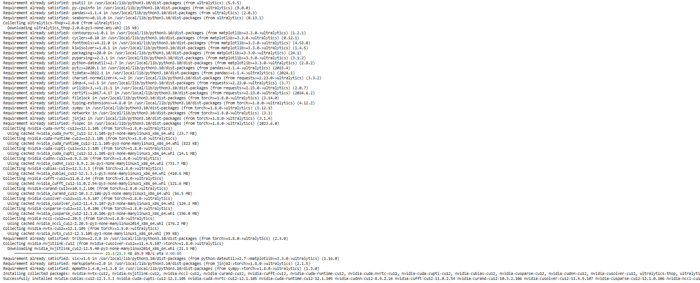
</div>

#### 安装yolov8

```from ultralytics import YOLO
import os
from IPython.display import display, Image
from IPython import display
display.clear_output()
!yolo checks
```

<div style="text-align: center;">
    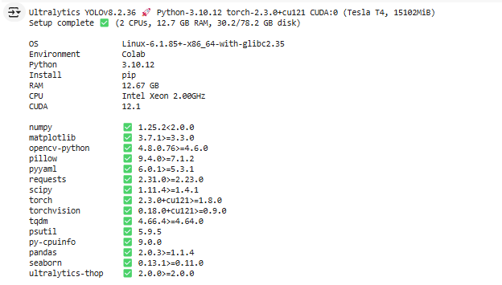
</div>

### 2.数据集训练
#### 训练YOLOv8模型

```
!pip install roboflow

from roboflow import Roboflow
rf = Roboflow(api_key="IZh9MYXlh58tx9RoLZ2f")
project = rf.workspace("national-technical-university-of-ukraine-igor-sikorsky-kyiv-polytechnic-institute-plrfe").project("det-ct-t")
version = project.version(2)
dataset = version.download("yolov8")
```

<div style="text-align: center;">
    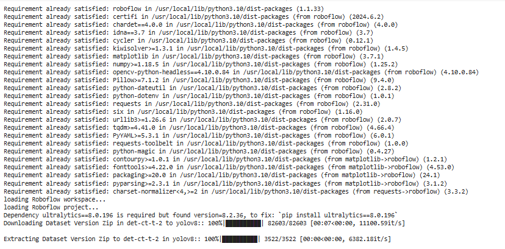
</div>

#### 设置epoch，batch

`!yolo task=detect mode=train model=yolov8m.pt data={dataset.location}/data.yaml epochs=20 imgsz=640`

<div style="text-align: center;">
    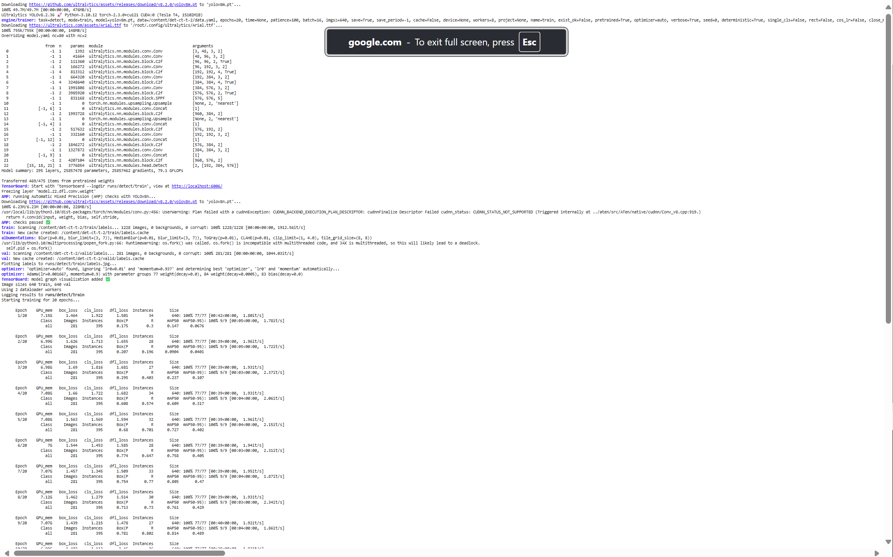
</div>

<div style="text-align: center;">
    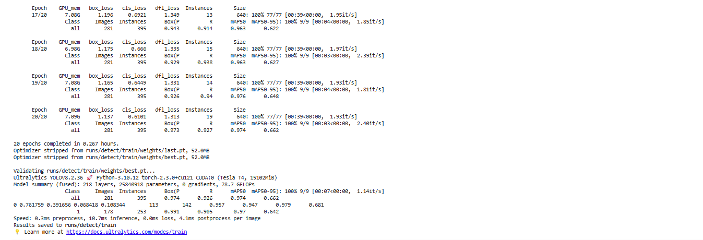
</div>

#### 查看结果图1

```
from IPython.display import Image, display
Image(filename=f'/content/runs/detect/train/confusion_matrix.png', width=600)
```

<div style="text-align: center;">
    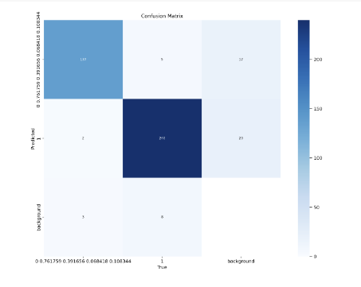
</div>

#### 查看结果图2

```
from IPython.display import Image, display
Image(filename=f'/content/runs/detect/train/results.png', width=600)
```

<div style="text-align: center;">
    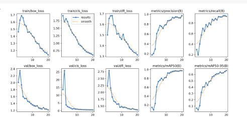
</div>

#### 查看best.pt相关参数

`!yolo task=detect mode=val model=/content/runs/detect/train/weights/best.pt data={dataset.location}/data.yaml`

<div style="text-align: center;">
    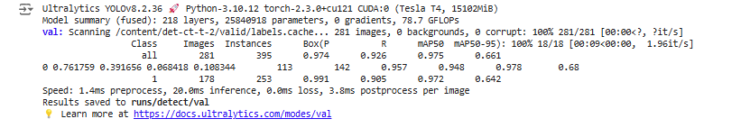
</div>

#### 下载best.pt

`!yolo task=detect mode=predict model=/content/runs/detect/train/weights/best.pt conf=0.5 source={dataset. location}/test/images`

<div style="text-align: center;">
    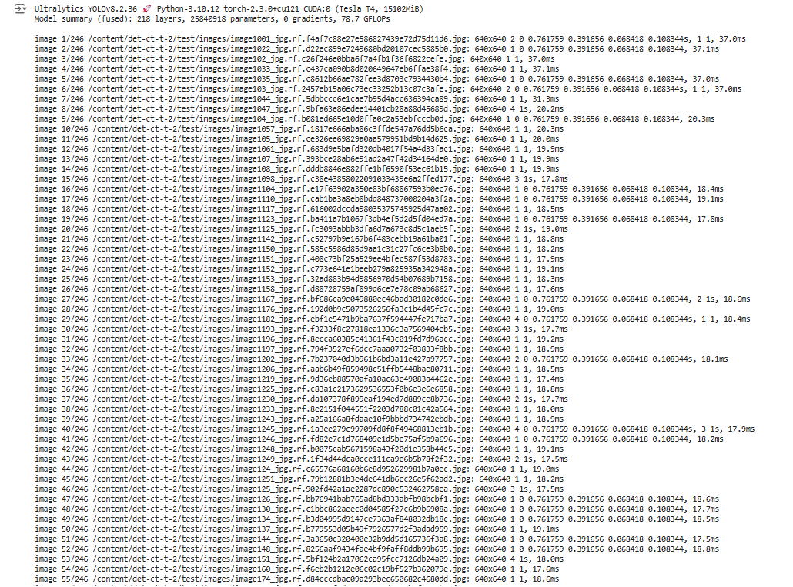
</div>

#### 查看训练结果图片

```
import glob
from IPython.display import Image, display

for image_path in glob.glob('/content/runs/detect/predict/*.jpg'):
  display(Image(filename=image_path, height=600))
  print("\n")

```
<div style="text-align: center;">
    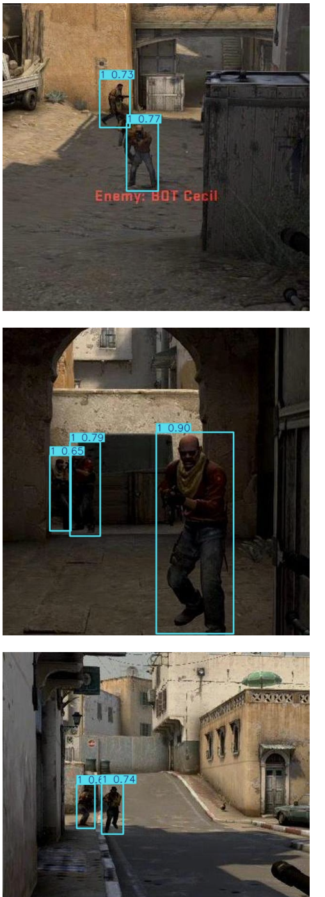
</div>

## 三、应用可视化开发

### 1.CSGO人物自瞄

#### 使用教程

```
python run z_detect5.py
```

<div style="text-align: center;">
    <video width="720" height="600" controls>
        <source src="csgo5倍速.mp4" type="video/mp4">
    </video>
</div>

### 2.猜拳游戏人机对战
#### 使用教程

```
python pip install -r requirement.txt
python run play.py
```

<div style="text-align: center;">
    <video width="720" height="600" controls>
        <source src="RSPx6.mp4" type="video/mp4">
    </video>
</div>

### 四、总结

在本文中，我们介绍了YOLO（You Only Look Once）目标检测模型的各个版本，分析了其演变和创新点，尤其是最新发布的YOLOv10。YOLO作为目标检测领域的先驱，从最初的版本到最新的v10版本，不断在精度、速度和效率上实现突破。YOLOv10引入了诸如取消后处理NMS（非极大值抑制）等创新，大大提升了推理速度，改善了模型的性能。

我们通过对比不同YOLO版本及其他常见目标检测模型（如RetinaNet、Faster R-CNN和SSD）的性能，展示了各个模型在不同数据集上的表现。数据对比结果表明，YOLO系列模型在实时性和准确性方面表现优异，特别是最新版本在各种应用场景中展现了强大的适应能力。

在具体应用方面，我们展示了YOLO在猜拳游戏中的实际应用。通过将YOLO模型集成到游戏中，实时识别玩家手势并进行判定，展示了YOLO在互动娱乐领域的潜力。尽管我们略过了CSGO鼠标自瞄展示，但该模型的推理时间和大小方面的优势同样适用于这种高实时性需求的应用场景。

总的来说，YOLO模型的持续改进为目标检测领域带来了更多可能性。其高效的实时检测能力使其在各类应用中都表现出色，从图像分类、目标定位到复杂的对象检测和图像分割。随着YOLOv10的发布，目标检测技术再一次迎来了新的里程碑。未来，随着技术的进一步发展和模型的持续优化，YOLO模型在更多领域的应用前景值得期待。

在实际应用过程中，我们发现模型的选择不仅要考虑精度和速度，还需要根据具体的应用场景和需求进行综合评估。模型轻量化和结构优化是提高推理效率的关键，而使用新颖的数据增强技术和自定义数据集微调训练，则能够进一步提升模型的实际应用效果。

总之，YOLO模型及其演变体现了目标检测技术的不断进步和发展。通过不断创新和优化，我们可以期待YOLO在更多领域实现更高的性能，满足各种复杂场景下的需求。


